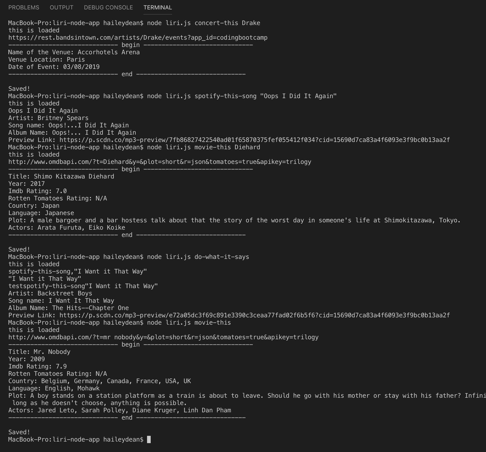

# liri-node-app

Liri is a Launguage Interpretation and Recognition Interface. Use LIRI to search Spotify for songs, Bands in Town for concerts, and OMDB for movies. 

## Installs

The [package.json] (https://github.com/hailsrenee/liri-node-app/blob/master/package.json) lists dependent node packages, but for your convenience, these are the ones to install.

### Spotify

`npm install node-spotify-api`

### Axios 

`npm install axios`

### Bands In Town 

`npm install bandsintown-api`

### Moment

`npm install momemt`

### DotEnv 

`npm install dotenv`

### FS 

`npm install fs`

## Get Started 

Here's a list of commands you can use in LIRI:

### Get Song Info

Retrieves info for a song: 

`node liri.js spotify-this-song "Song Name"`

### Get Concert Info

Retrieves info about concerts for an artist:

`node liri.js concert-this "Artist's Name"`

### Get Movie Info

Retrieves movie info:

`node liri.js movie-this "Movie Name"`

### Get Random Info

Retrieves random text from a file and does what it says:

`node liri.js do-what-it-says`

